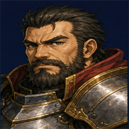
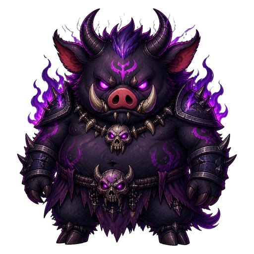
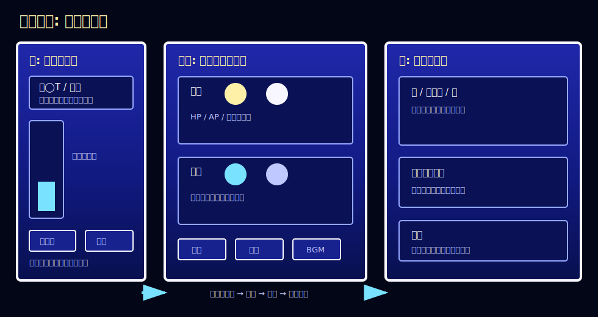

# 闇豚の塔

ブラウザで遊べる小さなJRPGです。仲間を集め、街を整え、十の塔を登って闇豚らんらんの討伐を目指します。

<p align="center">
  
  
  
</p>

## 遊び方
https://ranran7144.github.io/game1/index.html をブラウザで開くと遊べます。

推奨画面サイズ: 1280x960 以上

または、`index.html` をブラウザで開くと遊べます。
ローカルでうまく開けない場合は、プロジェクトフォルダで次を実行してから表示してください。

```powershell
python -m http.server 8000 --bind 127.0.0.1
```

そのあとブラウザで開きます。

```text
http://127.0.0.1:8000/index.html
```

## 画面の見方



画面は大きく3つに分かれています。

- 左: 進行パネル。現在のターン、フェーズ、塔の進行度、移動やイベント処理のボタンが表示されます。
- 中央: パーティパネル。前衛・後衛の仲間、HP、AP、行動ボタンが表示されます。
- 右: メイン画面。街、探索先、敵、戦闘ログ、各種コマンドが表示されます。

### ステータス画面

画面上部の `ステータス` から、仲間全員の能力を一覧できます。
編成、道具、装備強化で誰を育てるか迷ったときに見る画面です。

| 項目 | 意味 |
| --- | --- |
| 名前 | 仲間の名前です。 |
| 職業 | 勇者、戦士、騎士、僧侶、魔法使い、狩人などの役割です。 |
| Lv | レベルです。戦闘経験値で上がります。 |
| HP | 体力です。0になると戦闘不能になります。 |
| AP | 魔法、回復、特殊行動などで使う行動ポイントです。 |
| 状態 | 毒、麻痺、眠りなどの状態異常です。`なし` なら正常です。 |
| 配置 | 前衛、後衛、両方のどこに置けるかを表します。 |
| 射程 | 攻撃できる距離です。数字が大きいほど後ろから攻撃しやすくなります。 |
| 攻撃 | 通常攻撃や攻撃魔法の強さに関係します。 |
| 属性 | `物理`、`魔法`、`両方` の攻撃タイプです。 |
| 物防 | 物理攻撃への防御力です。 |
| 魔防 | 魔法攻撃への防御力です。 |
| 敏捷 | 行動順に関係します。高いほど先に動きやすくなります。 |
| 内政 | 内政ターンで得られる内政Pに関係します。 |
| 経験値 | 現在の経験値 / 次のレベルに必要な経験値です。 |

## 基本操作

### 街でできること

- `探索へ`: 挑戦する塔を選んで探索を開始します。
- `ステータス`: 仲間全員の能力を一覧で確認します。
- `酒場`: 内政Pを使って仲間を勧誘します。
- `建築`: 酒場やギルドを建てて、仲間候補や探索補助を増やします。
- `武器防具屋`: ゴールドを使って装備を強化します。
- `編成`: 前衛・後衛・控えを入れ替えます。ドラッグ操作で移動できます。
- `道具`: 種や実を使って仲間の能力を上げます。
- `セーブ` / `ロード`: 内政ターン中にゲームを保存・再開できます。
- `BGM`: 音量を切り替えます。ブラウザの仕様で、最初はボタンを押すまで音が鳴らないことがあります。

### 探索でできること

- `登る`: 現在の塔を1階ぶん進み、戦闘を行います。
- `帰る`: 探索を終えて街へ戻り、イベントターンへ進みます。

### 戦闘でできること

- `攻撃`: APを1使って射程内の敵を通常攻撃します。
- `魔法`: 魔法使いや勇者がAPを使って攻撃します。
- `回復`: 僧侶や勇者がAPを使って仲間を回復します。
- `待機`: 行動せずにターンを進めます。

### 成長と編成の目安

| 画面 | 使いどころ |
| --- | --- |
| 編成 | 前衛は硬い仲間、後衛は魔法・弓・回復役を置きます。 |
| 道具 | 種や実は、主力や足りない能力を補いたい仲間に使います。 |
| 建築 | 酒場、盗賊ギルド、狩人ギルド、商人ギルドを増やすと選択肢が広がります。 |
| 武器防具屋 | 詰まったら装備をまとめて強化すると突破しやすくなります。 |

## ターンの流れ

1. 内政ターンで仲間、装備、建築を整えます。
2. 探索へ出て塔を登ります。
3. 戦闘に勝つと上の階へ進めます。帰るまで探索ターンは続きます。
4. 探索を終えるとイベント処理になります。
5. イベント処理後、次の内政ターンへ進みます。

最終戦で闇豚らんらんを倒すとエンディングです。クリア後は、クリアターンに応じた内政Pボーナスを持って最初からやり直せます。

## 公開メモ

GitHub Pages で公開する場合は、リポジトリの Settings から Pages を開き、`Deploy from a branch` で `main` / `/root` を選ぶと `index.html` が公開されます。

## クレジット

音楽: 魔王魂  
https://maou.audio/

このゲームでは魔王魂のBGM素材を使用しています。

## ライセンス

ゲーム本体のソースコードや画像素材の扱いは、別途ライセンスを設定してください。魔王魂の音楽素材は魔王魂の利用規約に従ってください。
